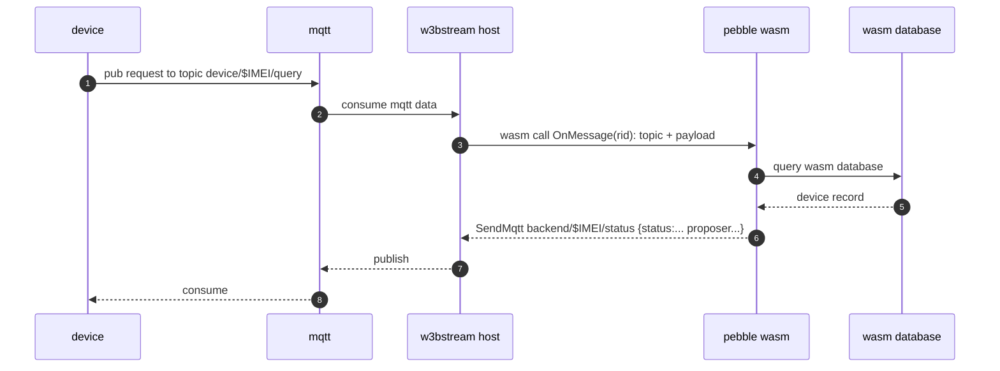

```mermaid
sequenceDiagram
    autonumber
    device ->> mqtt: pub request to topic device/$IMEI/query
    mqtt ->> w3bstream host: consume mqtt data
    w3bstream host ->> pebble wasm: wasm call OnMessage(rid): topic + payload
    pebble wasm ->> wasm database: query wasm database
    wasm database -->> pebble wasm: device record
    pebble wasm -->> w3bstream host: SendMqtt backend/$IMEI/status {status:... proposer...}
    w3bstream host -->> mqtt: publish
    mqtt -->> device: consume
```