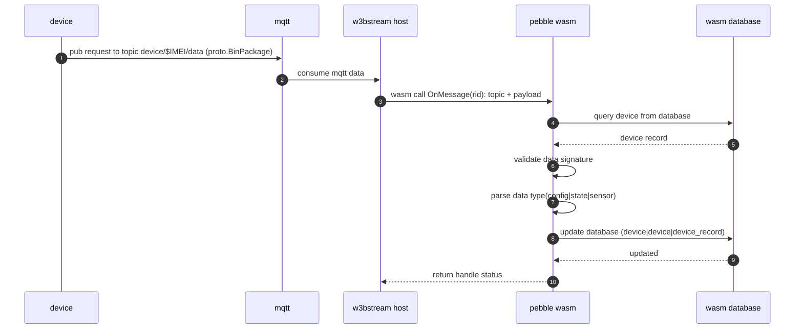

```mermaid
sequenceDiagram
    autonumber
    device ->> mqtt: pub request to topic device/$IMEI/data (proto.BinPackage)
    mqtt ->> w3bstream host: consume mqtt data
    w3bstream host ->> pebble wasm: wasm call OnMessage(rid): topic + payload
    pebble wasm ->> wasm database: query device from database
    wasm database -->> pebble wasm: device record
    pebble wasm ->> pebble wasm: validate data signature
    pebble wasm ->> pebble wasm: parse data type(config|state|sensor)
    pebble wasm ->> wasm database: update database (device|device|device_record)
    wasm database -->> pebble wasm: updated
    pebble wasm -->> w3bstream host: return handle status
```
