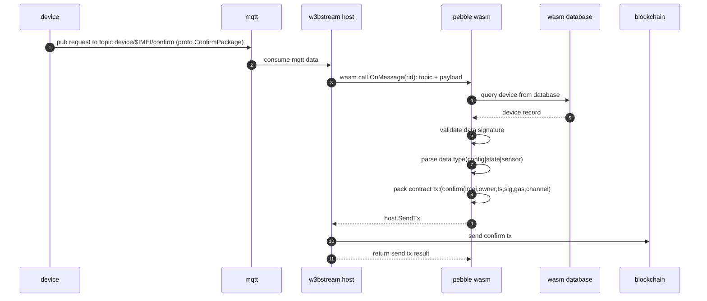

```mermaid
sequenceDiagram
    autonumber
    device ->> mqtt: pub request to topic device/$IMEI/confirm (proto.ConfirmPackage)
    mqtt ->> w3bstream host: consume mqtt data
    w3bstream host ->> pebble wasm: wasm call OnMessage(rid): topic + payload
    pebble wasm ->> wasm database: query device from database
    wasm database -->> pebble wasm: device record
    pebble wasm ->> pebble wasm: validate data signature
    pebble wasm ->> pebble wasm: parse data type(config|state|sensor)
    pebble wasm ->> pebble wasm: pack contract tx:(confirm(imei,owner,ts,sig,gas,channel)
    pebble wasm -->> w3bstream host: host.SendTx
    w3bstream host ->> blockchain: send confirm tx
    w3bstream host -->> pebble wasm: return send tx result
```
