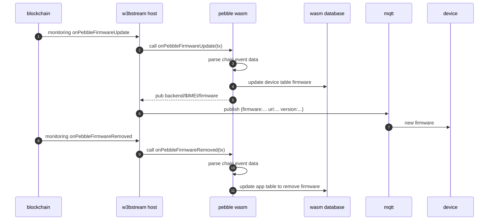

```mermaid
sequenceDiagram
    autonumber
    blockchain ->> w3bstream host: monitoring onPebbleFirmwareUpdate
    w3bstream host ->> pebble wasm: call onPebbleFirmwareUpdate(tx)
    pebble wasm ->> pebble wasm: parse chain event data
    pebble wasm ->> wasm database: update device table firmware
    pebble wasm -->> w3bstream host: pub backend/$IMEI/firmware
    w3bstream host ->> mqtt: publish {firmware:... uri:... version:...}
    mqtt ->> device: new firmware
    blockchain ->> w3bstream host: monitoring onPebbleFirmwareRemoved
    w3bstream host ->> pebble wasm: call onPebbleFirmwareRemoved(tx)
    pebble wasm ->> pebble wasm: parse chain event data
    pebble wasm ->> wasm database: update app table to remove firmware
```
